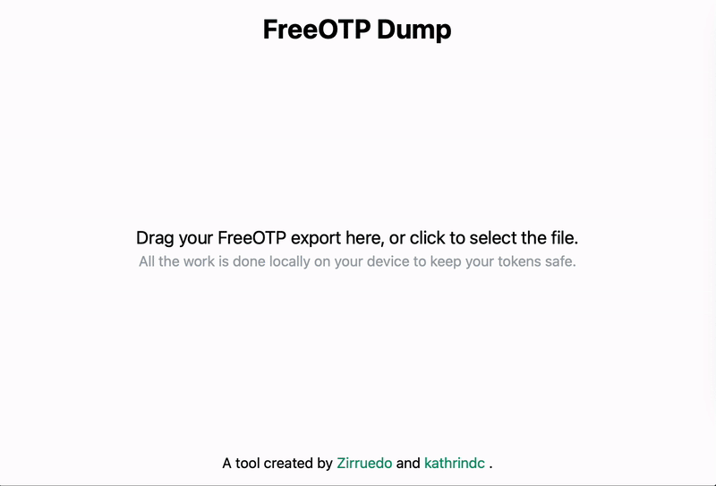

# 🔑 FreeOTP Dump

[Live version here](https://freeotp-dump.toast.ws)

This project allows you to easily export any TOTP tokens from FreeOTP by parsing the app's export file and giving you QRCodes for all your tokens to scan them in another app.

All of the file processing and decryption happens in your browser on your device. This way there is no need to send sensitive key data across the internet.

# Copyright

This project was created by [Zirruedo](https://github.com/lukas-schaffer) and [kathrindc](https://toast.ws).
